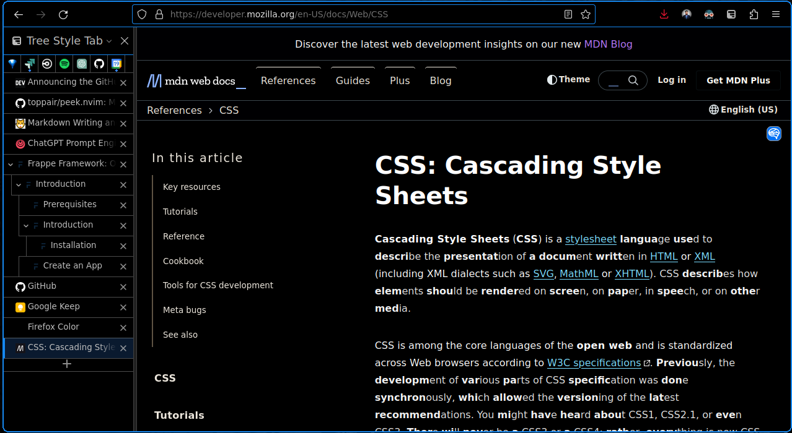

<div align = "center">

<h1><a href="https://addons.mozilla.org/en-US/developers/addon/nightblue/">Nightblue</a></h1>

<a href="https://github.com/2KAbhishek/nightblue/blob/main/LICENSE">
 </a>

<a href="https://github.com/2KAbhishek/nightblue/graphs/contributors">
 </a>

<a href="https://github.com/2KAbhishek/nightblue/stargazers">
</a>

<a href="https://github.com/2KAbhishek/nightblue/network/members">
 </a>

<a href="https://github.com/2KAbhishek/nightblue/watchers">
 </a>

<a href="https://github.com/2KAbhishek/nightblue/pulse">
 </a>

<h3>Black and Blue for Night watchers 🦉🔭</h3>

<figure>
  
  <br/>
  <figcaption>Nightblue in action</figcaption>
</figure>

</div>

[Nightblue](https://addons.mozilla.org/en-US/developers/addon/nightblue/) is a pitch black theme for Firefox Desktop and Android.

## ✨ Features

- Aesthetically pleasing and minimalistic colors
- Optimized for AMOLED displays

## Setup

### ⚡ Requirements

To replicate the setup show on screenshot you need the following plugins:

- [Dark Reader](https://addons.mozilla.org/en-US/firefox/addon/darkreader/)
- [Tree Style Tab](https://addons.mozilla.org/en-US/firefox/addon/tree-style-tab/)

##### To disable the Native tab bar do the following,

- Enter `about:config` in the URL bar
- Change the value of `toolkit.legacyUserProfileCustomizations.stylesheets` to `true`
- Click on Firefox menu > Help > More troubleshooting info
- Search for Profile Directory on the page and navigate to it: e.g: `/home/abhishek/.mozilla/firefox/krel8zkj.default-release`
- Create a `chrome` folder if not present
- Add the following to `userChrome.css` in that folder

```css
#TabsToolbar {
  visibility: collapse;
}
```

- If you want to hide the sidebar heading add the following as well

```css
#sidebar-header {
   visibility: collapse !important;
}
```
- Don't forget to restart Firefox as well

### 🚀 Installation

Just go to [Nightblue](https://addons.mozilla.org/en-US/developers/addon/nightblue/) and install the theme.

##  Behind The Code

### 🌈 Inspiration

Needed a theme to match rest of my setup

- [awesome2k](https://github.com/2kabhishek/awesome2k)
- [rofi2k](https://github.com/2kabhishek/rofi2k)

### 💡 Challenges/Learnings

- Learned about the Firefox plugin ecosystem

### 🧰 Tooling

- [Firefox Color](https://color.firefox.com/)

<hr>

<div align="center">

<strong>⭐ hit the star button if you found this useful ⭐</strong><br>

<a href="https://github.com/2KAbhishek/nightblue">Source</a>
| <a href="https://2kabhishek.github.io/blog" target="_blank">Blog </a>
| <a href="https://twitter.com/2kabhishek" target="_blank">Twitter </a>
| <a href="https://linkedin.com/in/2kabhishek" target="_blank">LinkedIn </a>
| <a href="https://2kabhishek.github.io/links" target="_blank">More Links </a>
| <a href="https://2kabhishek.github.io/projects" target="_blank">Other Projects </a>

</div>

